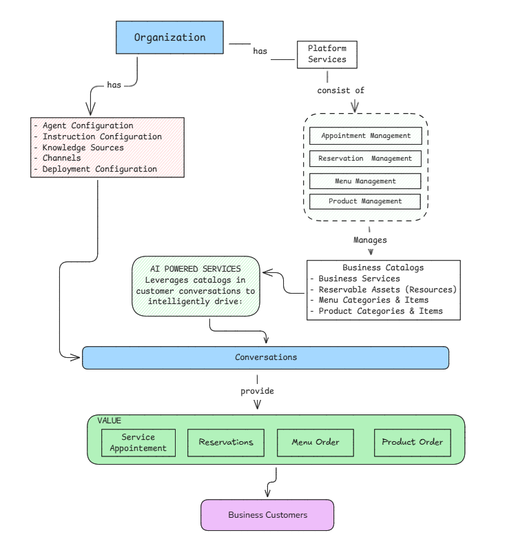

# WIIL Python SDK

Official Python SDK for the [WIIL Platform](https://console.wiil.io) - AI-powered conversational services platform for intelligent customer interactions, voice processing, real-time translation, and business management.

[](https://www.python.org/)
[](https://opensource.org/licenses/MIT)

## Features

- ✅ **Type-Safe** - Full type hints with Pydantic models
- ✅ **Production-Grade** - Built for enterprise use with robust error handling
- ✅ **Validated** - Runtime validation using Pydantic
- ✅ **Well-Documented** - Comprehensive docstrings and API documentation
- ✅ **Tested** - Extensive test coverage with pytest
- ✅ **Modern** - Async/await support with httpx
- ✅ **Comprehensive** - Access to all WIIL Platform domains

## Installation

```bash
pip install wiil
```

## Quick Start

```python
from wiil import WiilClient

# Initialize the client with your API key
client = WiilClient(api_key="your-api-key")

# Get your organization
organization = client.organizations.get()
print(f"Organization: {organization.company_name}")

# Create a project
project = client.projects.create(
    name="Production Environment",
    description="Main production deployment"
)

print(f"Project created: {project.id}")
```

## Platform Architecture

The WIIL Platform provides a unified architecture that bridges AI agent deployment with business operations, enabling organizations to conduct intelligent customer conversations that drive measurable business outcomes.

### Unified Architecture Overview

The platform integrates two core architectural domains through the **Conversations** entity:



### Core Architectural Domains

#### 1. Service Configuration

**Purpose**: Manages the deployment and behavior of AI agents within the platform.

**Key Components**:

- **Agent Configurations** - Define AI agent capabilities and characteristics
- **Instruction Configurations** - The heart of agent behavior with system prompts, guidelines, and compliance rules
- **Deployment Configurations** - Combine agents and instructions into deployable units
- **Deployment Channels** - Communication channels (OTT Chat, Telephony, SMS, Email)
- **Phone Configurations** - Telephony-specific settings for voice calls
- **Conversation Configurations** - Configuration for conversation sessions
- **Knowledge Sources** - Knowledge bases for agent context and accuracy

**SDK Resources**: `agent_configs`, `instruction_configs`, `deployment_configs`, `deployment_channels`, `phone_configs`, `conversation_configs`, `knowledge_sources`

#### 2. Advanced Service Configuration

**Purpose**: Enables voice-powered conversations with end-to-end processing pipelines.

**Key Components**:

- **Provisioning Chain Configurations** - STT → Agent → TTS voice processing workflows
- **Speech-to-Text (STT)** - Voice-to-text conversion using Deepgram, OpenAI Whisper, Cartesia
- **Text-to-Speech (TTS)** - Natural voice generation using ElevenLabs, Cartesia, OpenAI

**SDK Resources**: `provisioning_configs`

#### 3. Translation Services

**Purpose**: Provides real-time multilingual voice translation capabilities.

**Key Components**:

- **Translation Chain Configurations** - STT → Translation Processing → TTS pipelines for language pairs
- **Translation Service Requests** - Initiate translation sessions
- **Translation Participants** - Multi-participant translation sessions with language isolation
- **Translation Service Logs** - Transcription logging and session records

**SDK Resources**: `translation_sessions`

#### 4. Business Management

**Purpose**: Manages business entity catalogs and their transactional operations through AI-powered conversations.

**Management Modules** (Platform Services):

| Module | Manages Catalog | Powers Transactions |
|--------|----------------|---------------------|
| **Appointment Management** | Business Services | Service Appointments |
| **Reservation Management** | Reservable Assets (Resources) | Reservations |
| **Menu Management** | Menu Categories & Items | Menu Orders |
| **Product Management** | Product Categories & Products | Product Orders |

**Business Catalogs**:

- **Business Services** - Bookable services (salons, clinics, consulting)
- **Reservable Assets** - Bookable resources (tables, rooms, equipment)
- **Menu Categories & Items** - Food and beverage offerings
- **Product Categories & Products** - Retail products

**Transactional Operations** (AI-Powered):

- **Service Appointments** - Created through AI conversations
- **Reservations** - Created through AI conversations
- **Menu Orders** - Created through AI conversations
- **Product Orders** - Created through AI conversations

**SDK Resources**: `business_services`, `reservation_resources`, `menus`, `products`, `customers`, `service_appointments`, `reservations`, `menu_orders`, `product_orders`

### Integration Hub: Conversations

The **Conversations** entity serves as the central integration point, bridging Service Configuration and Business Management:

**Key Attributes**:

```python
{
  # Service Configuration References
  "deployment_config_id": str,      # Which agent deployment
  "instruction_config_id": str,     # Agent behavior guidelines
  "channel_id": str,                # Communication channel

  # Business Context
  "customer_id": str,               # Business customer
  "conversation_type": str,         # OTT_CHAT, TELEPHONY_CALL, SMS, EMAIL

  # Conversation Data
  "messages": list,                 # Conversation history
  "status": str,                    # ACTIVE, COMPLETED, TRANSFERRED
  "conversation_summary": dict      # AI-generated summary
}
```

**Role in Architecture**:

1. **Links** AI agents (via deployment/instruction configs) with business customers
2. **Enables** AI agents to leverage business catalogs during conversations
3. **Drives** transactional outcomes (appointments, reservations, orders)
4. **Supports** multi-channel conversations (voice, chat, SMS, email)

### Data Flow: Conversation to Transaction

```text
1. Customer Initiates Contact
         ↓
2. Channel Routes to Deployment Configuration
         ↓
3. Conversation Created
   • Links deployment_config_id
   • Links instruction_config_id
   • Links channel_id
   • Links customer_id
         ↓
4. AI Agent Conducts Conversation
   • Guided by Instruction Configuration
   • Queries Business Catalogs (via Management Modules)
   • Presents available services/products/resources
         ↓
5. Customer Confirms Intent
         ↓
6. Transaction Created
   • Service Appointment
   • Reservation
   • Menu Order
   • Product Order
         ↓
7. Management Module Processes Transaction
```

### Design Principles

**Unified Customer Experience**: Customers interact through Conversations, unaware of the underlying system complexity.

**Separation of Configuration and Execution**: Service Configuration defines *how* agents behave; Business Management defines *what* they can do.

**AI-First Conversations**: AI Powered Services leverages catalog data in customer conversations to intelligently drive transactional operations.

**Catalog-Transaction Separation**: Clear distinction between catalog/configuration data (managed by Management Modules) and transactional data (powered by AI Powered Services through conversations).

**Multi-Channel Support**: Conversations span multiple channel types (OTT Chat, Telephony, SMS, Email).

**Transactional Outcomes**: Every conversation can result in measurable business transactions.

## Usage Examples

### Account Management

```python
from wiil import WiilClient

client = WiilClient(api_key="your-api-key")

# Get your organization (read-only)
org = client.organizations.get()
print(f"Organization: {org.company_name}")

# Create a project
project = client.projects.create(
    name="Production Environment",
    description="Main production deployment"
)

# Get a project
project = client.projects.get("proj_123")

# Update a project
updated = client.projects.update(
    id="proj_123",
    name="Production Environment v2"
)

# Delete a project
deleted = client.projects.delete("proj_123")

# List projects
projects = client.projects.list(page=1, page_size=20)
```

### Service Configuration

```python
# Create an agent configuration
agent = client.agent_configs.create(
    name="Customer Support Agent",
    description="AI agent for customer support"
)

# Get agent configuration
agent = client.agent_configs.get("agent_123")

# List agent configurations
agents = client.agent_configs.list(page=1, page_size=20)
```

### Business Management

```python
# Create a business service
service = client.business_services.create(
    name="Hair Cut",
    description="30-minute hair cut service",
    duration=30,
    price=50.00
)

# Create a customer
customer = client.customers.create(
    name="John Doe",
    email="john@example.com",
    phone="+1234567890"
)

# Create a service appointment
appointment = client.service_appointments.create(
    customer_id="customer_123",
    service_id="service_123",
    scheduled_date="2025-01-15",
    scheduled_time="14:00"
)
```

## Error Handling

```python
from wiil import WiilClient
from wiil.errors import (
    WiilAPIError,
    WiilValidationError,
    WiilNetworkError,
    WiilConfigurationError
)

try:
    project = client.projects.create(name="My Project")
except WiilValidationError as e:
    print(f"Validation failed: {e.message}")
    print(f"Details: {e.details}")
except WiilAPIError as e:
    print(f"API Error {e.status_code}: {e.message}")
    print(f"Error Code: {e.code}")
except WiilNetworkError as e:
    print(f"Network error: {e.message}")
except WiilConfigurationError as e:
    print(f"Configuration error: {e.message}")
```

## Async Support

```python
from wiil import AsyncWiilClient

async def main():
    async with AsyncWiilClient(api_key="your-api-key") as client:
        # Get organization
        org = await client.organizations.get()
        print(f"Organization: {org.company_name}")

        # Create project
        project = await client.projects.create(
            name="Production",
            is_default=True
        )
        print(f"Project: {project.id}")

import asyncio
asyncio.run(main())
```

## Development

### Setup

```bash
# Clone the repository
git clone https://github.com/wiil-io/wiil-python.git
cd wiil-python

# Create virtual environment
python -m venv venv
source venv/bin/activate  # On Windows: venv\Scripts\activate

# Install development dependencies
pip install -e ".[dev]"
```

### Testing

```bash
# Run tests
pytest

# Run tests with coverage
pytest --cov=wiil --cov-report=html

# Run specific test file
pytest tests/unit/test_client.py
```

### Code Quality

```bash
# Format code with black
black wiil tests

# Lint with ruff
ruff check wiil tests

# Type check with mypy
mypy wiil
```

## Requirements

- **Python**: 3.8 or higher
- **Dependencies**: httpx, pydantic

## Security

⚠️ **Important**: This SDK is designed for **server-side use only**. Never expose your API key in client-side code.

- Store API keys securely using environment variables
- Never commit API keys to version control
- Use environment-specific API keys (development, staging, production)
- Rotate API keys regularly

### Best Practices

```python
import os
from wiil import WiilClient

# ✅ Good - Use environment variables
client = WiilClient(api_key=os.getenv("WIIL_API_KEY"))

# ❌ Bad - Never hardcode API keys
client = WiilClient(api_key="your-api-key-here")  # Don't do this!
```

## License

MIT © [WIIL](https://console.wiil.io)

## Support

- **Documentation**: [https://docs.wiil.io](https://docs.wiil.io)
- **API Reference**: [https://docs.wiil.io/developer/api-reference](https://docs.wiil.io/developer/api-reference)
- **Issues**: [GitHub Issues](https://github.com/wiil-io/wiil-python/issues)
- **Email**: [dev-support@wiil.io](mailto:dev-support@wiil.io)

## Contributing

Contributions are welcome! Please read our [Contributing Guide](CONTRIBUTING.md) for details on our code of conduct and the process for submitting pull requests.

---

Built with ❤️ by the WIIL team
